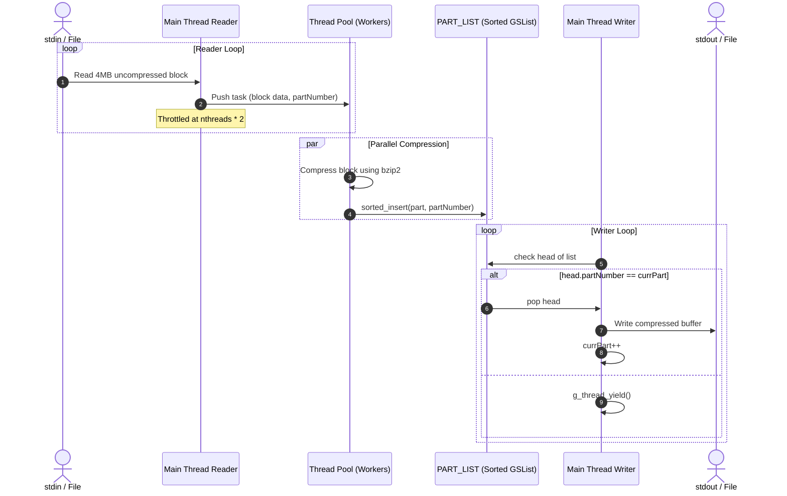

Repository directory map and code logic catalog for zipmt.

TLDR:
    Impact: Visualizes structure, module indexing, and file responsibilities.
    Next Steps: Refer to architectural decisions and lessons learned.

# zipmt Repository Mindmap

This document serves as the repository mindmap, categorizing the codebase and project structure to help developers and agents navigate files and logical concepts.

---

## 1. Directory Tree & Code Map

```mermaid
mindmap
  root((zipmt Project))
    Documentation
      README.md["README.md (Entry point)"]
      MINDMAP.md["MINDMAP.md (This file)"]
      docs_ARCH["docs/ARCH.md (Architecture)"]
      docs_USAGE["docs/USAGE.md (User Guide)"]
    C Source Code
      src_Makefile["src/Makefile (Build targets)"]
      src_zipmt["src/zipmt.c (Main logic)"]
    Go Source Code
      go_main["zipmt-go/main.go (Go Entry)"]
      go_zipmt["zipmt-go/zipmt/*.go (Goroutines, Channels, Compressors)"]
    Agents Workspace
      agents_CHAT["agents/CHAT.md (Handoff Log)"]
      agents_PROJ["agents/PROJECT.md (Tool Capabilities)"]
      agents_docs["agents/*.docs/ (Agent Memory)"]
      agents_tools["agents/tools/ (Agent Utilities)"]
```

---

## 2. Source Code Architecture Map (`src/zipmt.c`)

The C source code is consolidated into a single file `src/zipmt.c`. The table below maps functions to their design patterns and responsibilities:

| Section / Function | Scope | Role | Implementation Highlights |
|-------------------|-------|------|---------------------------|
| **Core & Setup** | | | |
| `main` | Entry | CLI Parsing, Initialization, Mode Selection | Set up `GOptionContext`, register signal handlers, validate combination of flags, invoke drivers. |
| `_sig_handler` | Signals | Signal interceptor | Sets atomic flag `_recieved_SIGINT = TRUE` to trigger graceful exit and delete partial files. |
| `getTmpFilen` | Utility | Filename construction | Constructs temporary filenames: `<filename>.tmp<n>`. |
| `file_part_compare` | Utility | Sorting comparator | Helper for sorted insertion of stream chunks by `partNumber`. |
| **Split Mode (File-Based)** | | | |
| `file_read_func` | Worker | Chunk compression (bzip2) | Reads a partitioned block from disk, compresses it via `BZ2_bzWrite`, writes to temp file. |
| `file_read_func_zlib` | Worker | Chunk compression (gzip) | Reads a partitioned block from disk, compresses it via `gzwrite`, writes to temp file. |
| `stat_func` | Monitoring | Progress terminal monitor | Loops every second, prints processing completion percentage per thread. Blocks until all threads complete. |
| **Stream Mode (Pipe-Based)**| | | |
| `stream_driver` | Driver | GLib Thread Pool pipeline coordinator | Manages sequential read loop, GThreadPool submission, thread throttling, and sequential output writer. |
| `stream_read_func` | Worker | Stream block compression | Worker executing `BZ2_bzCompress` on a block, inserts result sorted into `PART_LIST`. |
| `omp_driver` | Driver | OpenMP pipeline coordinator | Alternative stream driver parallelizing compression using OpenMP `#pragma omp parallel for`. |

---

## 2.1. Go Source Code Architecture Map (`zipmt-go/`)

The Go codebase is modularized under the `zipmt-go/` directory. Below is the map of its components:

| File / Component | Package | Role | Implementation Highlights |
|------------------|---------|------|---------------------------|
| `main.go` | `main` | Entry Point | Parses CLI flags, opens file/stdin readers, configures stdout/file writers, and calls `zipmt.ZipMt`. |
| `zipmt/zipmt.go` | `zipmt` | Pipeline Core | Defines algorithms (`XZ`, `BZ2`, `GZ`), `Compressor` interface, `ZipPart` struct, and initiates the reader thread. |
| `zipmt/zipwriter.go` | `zipmt` | Writer Manager | Implements `io.Writer`. Coordinates the lifecycle of the compressor pool and the write worker. |
| `zipmt/compression_worker.go` | `zipmt` | Compression Pool | Goroutines that consume uncompressed buffers from `jobs`, shrink them, and post to `results`. |
| `zipmt/write_worker.go` | `zipmt` | Sequential Writer | Goroutines that fetch finished jobs off `results` and reorder them via maps before disk writes. |
| `zipmt/xzzipper.go` | `zipmt` | XZ Compressor | Implements `Compressor` using `github.com/ulikunitz/xz`. **Contains Verify crash bug.** |
| `zipmt/bz2zipper.go` | `zipmt` | BZ2 Compressor | Implements `Compressor` using `github.com/larzconwell/bzip2` and `compress/bzip2`. |
| `zipmt/gzipper.go` | `zipmt` | Gzip Compressor | Implements `Compressor` using standard library `compress/gzip`. |
| `zipmt/zipmt_test.go` | `zipmt` | Unit Testing | Tests individual compressors and the write block pipeline. **Contains hardcoded fail.** |

---

## 3. Communication & State Flow

The following sequence illustrates how data flows dynamically during streaming:



---

## 4. Key Configurations & Constants

- `NTHREADS` (default: 4): The fallback number of threads if `-t` is not specified.
- `READBUFZ` (4MB): Size of the read buffer for each stream part.
- `WRITEBUFZ` (5MB): Size of the write buffer, allowing extra memory for potential expansion/inflation under negative compression ratios.
