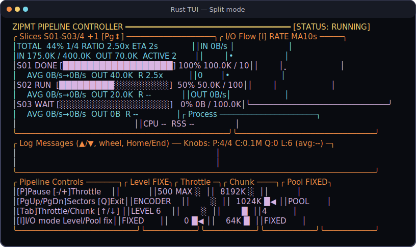
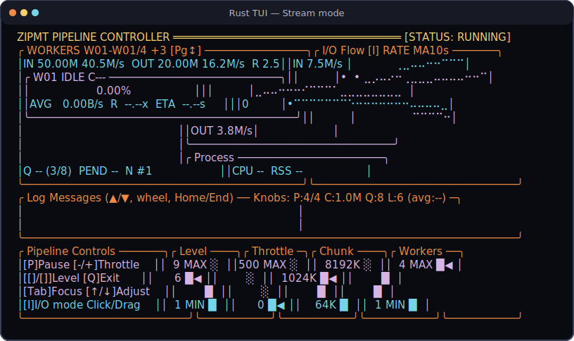

Parallel compression utilities implemented in Rust, Go, and C.

TLDR:
    Goal: Compress files and streams across CPU cores with xz, bzip2, or gzip.
    Status: The Rust implementation is the recommended, tested CLI with an optional interactive TUI.
    Action: Build zipmt-rust, then use --no-tui for scripts or -T for the live dashboard.

# zipmt

`zipmt` is a collection of multi-threaded compression utilities. The Rust
implementation is the recommended version: it supports file and stream
pipelines, bounded memory, integrity verification, safe cleanup, and an
interactive terminal dashboard.

| Implementation | Formats | Best for | Status |
|---|---|---|---|
| [`zipmt-rust/`](zipmt-rust/) | xz, bz2, gz | Current CLI, automation, and interactive monitoring | Recommended |
| [`zipmt-go/`](zipmt-go/) | xz, bz2, gz | Go pipeline reference | Maintained |
| [`src/`](src/) | bz2, gz | Original C/OpenMP implementation | Legacy; deletes source files unless `-k` is used |

## Rust TUI

Pass `-T` to monitor compression in a terminal. File input uses the Split
dashboard; standard input uses the Stream dashboard. Both views expose live
I/O, process metrics, logs, paging, and runtime controls.

### Split mode



### Stream mode



The images are generated from the same tested 80×22 snapshot fixtures used by
the Rust test suite:

```bash
make rust-tui-screenshots
```

## Quick start

### Build the Rust implementation

```bash
cd zipmt-rust
cargo build --release
```

The binary is written to `zipmt-rust/target/release/zipmt-rust`.

### Compress a file

```bash
# Creates archive.tar.xz and preserves archive.tar
zipmt-rust/target/release/zipmt-rust archive.tar

# Select gzip, level 6, and four workers
zipmt-rust/target/release/zipmt-rust -a gz -l 6 -j 4 archive.tar
```

### Open the interactive dashboard

```bash
zipmt-rust/target/release/zipmt-rust -T -o archive.tar.xz archive.tar
```

The TUI requires a terminal of at least 80 columns by 22 rows. Use
`--no-tui` for scripts and redirected diagnostics.

### Compress a stream

```bash
tar -cf - ./my-folder \
  | zipmt-rust/target/release/zipmt-rust --no-tui -a xz -o my-folder.tar.xz -
```

### Verify an existing compressed file

```bash
zipmt-rust/target/release/zipmt-rust --test -a xz archive.tar.xz
```

## TUI controls

| Key | Action |
|---|---|
| `P` | Pause or resume compression |
| `-` / `+` | Increase or decrease throttle delay |
| `I` | Toggle rate and cumulative I/O charts |
| `PgUp` / `PgDn`, mouse wheel | Page through slices or workers |
| `Tab`, `↑` / `↓` | Select and adjust an available control |
| `Home` / `End` | Jump to the oldest or newest log messages |
| `Q` / `Esc` | Abort and clean up an incomplete output; close a completed dashboard |
| `Enter` | Close a completed dashboard |

Stream mode also supports `[` / `]` for compression level. Controls labeled
`FIXED` in Split mode cannot change after its encoders are created.

## Safety notes

- Rust and Go preserve the source file unless explicitly told otherwise.
- Rust `--delete` removes the source only after successful compression.
- The legacy C implementation deletes its source by default; always pass
  `-k` / `--keep` when the original must be retained.
- Partial Rust output files are removed on errors and Ctrl-C.

## Documentation

- [Complete user guide](docs/USAGE.md)
- [Rust architecture](docs/ARCH_RUST.md)
- [Project architecture](docs/ARCH.md)
- [Rust quality tooling](docs/RUST_QUALITY_TOOLING.md)
- [Repository mind map](MINDMAP.md)

## Repository layout

```text
├── README.md
├── docs/
│   ├── USAGE.md
│   ├── ARCH_RUST.md
│   └── assets/                 # Generated Rust TUI screenshots
├── scripts/
│   └── render_tui_screenshots.py
├── zipmt-rust/                 # Recommended Rust implementation
├── zipmt-go/                   # Go implementation
├── src/                        # Legacy C implementation
└── agents/                     # Bob Protocol team state and workflows
```
