Architecture overview for the zipmt multi-threaded compression utility.

TLDR:
    Impact: Establishes components, thread models, data structures, and pipeline flow.
    Next Steps: Document usage, decisions, and lessons.

# zipmt Architecture Overview

This document provides a high-level architectural overview of the `zipmt` multi-threaded compression utility.

## 1. System Overview

`zipmt` is a command-line tool written in C that performs multi-threaded data compression using either the **bzip2** (default) or **gzip** algorithm. It is designed to accelerate compression on multi-core systems by parallelizing the compression workload across multiple threads.

The utility operates in one of two major parallelization modes:
1. **Split Mode (Default / File-Based):** Best for compressing large files on disk. The input file is statically split into `N` equal-sized chunks. Each chunk is compressed in parallel by a worker thread to a temporary file. Once all threads are complete, the main thread concatenates the temporary files in the correct sequence to produce the final compressed file.
2. **Stream Mode (Stream-Based):** Triggered by specifying `--stream` (`-s`) or automatically when compressing from standard input (`-`). The input stream is read sequentially in fixed-size blocks (default 4MB). These blocks are submitted to a thread pool for parallel compression. A reordering queue ensures that the compressed blocks are written to the output file in the original sequential order.

---

## 2. Architectural Principles

- **Concurrency via GLib:** Concurrency and thread management are abstracted using the GLib library's `GThreadPool` and thread utilities.
- **Optional OpenMP Concurrency:** Supports loop-level parallelization via OpenMP (`#pragma omp parallel for`) in stream mode as an alternative to GLib thread pools.
- **Divide and Conquer:** Statically partitions files in Split Mode to eliminate the need for inter-thread synchronization during compression, maximizing parallel efficiency.
- **Pipeline Processing with Reordering:** Uses a thread-safe priority queue (sorted linked list) in Stream Mode to decouple sequential reading/writing from parallel compression.

---

## 3. Component Diagram

The following Mermaid diagram shows the components and data flow for both modes of operation:

```mermaid
graph TD
    subgraph Split Mode
        A[Input File] -->|Stat File Size| B[Main Thread]
        B -->|Statically Split into N parts| C[Worker Threads]
        C -->|Compress Chunk| D[Temp Files .tmp0 ... .tmpN-1]
        D -->|Ordered Cat| E[Output File]
    end

    subgraph Stream Mode
        F[Input Stream / stdin] -->|Sequential Read| G[Main Thread Reader]
        G -->|Push 4MB Blocks| H[GLib Thread Pool / OpenMP]
        H -->|Compress in Parallel| I[Reordering Queue PART_LIST]
        I -->|Sorted Insert & Match currPart| J[Main Thread Writer]
        J -->|Sequential Write| K[Output Stream / stdout]
    end
```



---

## 4. Class & Data Structures

`zipmt` defines two main data structures to manage task state:

### `tp_args_t` (Used in Split Mode)
Represents the task configuration and tracking structure for a single chunk of the input file.
```c
typedef struct tp_args {
  const gchar* filen;        // Input filename
  off_t startPos;            // Start byte offset of chunk
  off_t endPos;              // End byte offset of chunk
  gint processed;            // Progress percentage (0 - 100)
  gchar tmpFilen[1024];      // Path to temporary file for this chunk
  gboolean error;            // Error flag set by worker thread
  gboolean verbose;          // Verbose output setting
  gboolean done;             // Done flag set by worker thread
} tp_args_t;
```

### `file_part_t` (Used in Stream Mode)
Represents a block of data traveling through the streaming pipeline.
```c
typedef struct file_part {
  off_t    partNumber;       // Monotonically increasing part number for reordering
  gchar    inBuf[READBUFZ];  // Input uncompressed buffer (4MB)
  gulong   inBufz;           // Actual bytes read into inBuf
  gchar    outBuf[WRITEBUFZ];// Output compressed buffer (5MB)
  gulong   outBufz;          // Actual compressed bytes in outBuf
  gboolean error;            // Error flag set during compression
} file_part_t;
```

### Thread Synchronization Structures (Stream Mode)
- `PART_LIST`: A Glib singly linked list (`GSList *`) representing the queue of finished blocks.
- `PART_LIST_LOCK`: A Glib mutex (`GMutex *`) guarding access to `PART_LIST`.

---

## 5. Sequence & Interaction Flows

### Split Mode Sequence
1. **Command Line Parsing:** Main thread parses arguments and verifies target files.
2. **Task Partitioning:** Calculates chunk size as `fileSize / nthreads`.
3. **Thread Pool Spawning:** Instantiates a GLib Thread Pool (`GThreadPool`) with size `nthreads`.
4. **Task Submission:** Submits `nthreads` instances of `tp_args_t` to the pool running `file_read_func` (for bzip2) or `file_read_func_zlib` (for gzip).
5. **Progress Monitoring:** If `-v` is set, the main thread runs `stat_func`, printing progress of each thread every second.
6. **Thread Reclamation:** Frees the thread pool, waiting for all threads to terminate.
7. **Assembly:** Renames the first temp file `.tmp0` to the target output filename, then appends the contents of the remaining temp files (`.tmp1` through `.tmpN-1`) in order.
8. **Cleanup:** Deletes all temporary files.

### Stream Mode Pipeline Sequence
1. **Thread Pool Initialization:** Main thread spawns thread pool targetting `stream_read_func` with `nthreads` workers.
2. **Reader Loop:**
   - Reads up to 4MB of data into a new `file_part_t` chunk.
   - Assigns a sequential `partNumber`.
   - Pushes the chunk to the thread pool (`g_thread_pool_push`).
   - Throttles input reading to prevent infinite buffer allocation if compression is slower than reading (limits pushed-but-incomplete parts to `nthreads * 2`).
3. **Compression Worker:**
   - Compresses the uncompressed buffer in-memory using `BZ2_bzCompress` (bzip2).
   - Locks `PART_LIST_LOCK`.
   - Inserts the completed chunk into `PART_LIST` sorted by `partNumber`.
   - Unlocks `PART_LIST_LOCK`.
4. **Writer Loop (Main Thread):**
   - Periodically checks the head of `PART_LIST`.
   - If the head matches `currPart` (the next expected sequential part), removes it from the list.
   - Writes the compressed output buffer to the output file or stdout.
   - Frees the slice (`g_slice_free`) and increments `currPart`.
5. **Drain Queue:** Once reader hits EOF, the thread pool is freed (waiting for remaining compression to finish). The main thread drains the remaining parts in `PART_LIST` sequentially and writes them out.

---

## 6. Technical Stack

- **Core Language:** C (GNU C Dialect)
- **External Dependencies:**
  - **GLib 2.0:** High-level platform abstraction (threads, mutexes, thread pools, data structures).
  - **bzip2 (libbz2):** Bzip2 block-sorting file compressor library.
  - **zlib (libz):** Zlib compression library (used in split mode gzip compression).
- **Compilation Toolchain:** GCC with OpenMP support enabled (`-fopenmp`).

---

## 7. Refactoring Status & Technical Debt

### Deprecated API Usage
The code uses several APIs that are deprecated or modified in modern GLib versions:
- `g_thread_init`: No longer needed or available in GLib >= 2.32 (threads are initialized automatically).
- `g_mutex_new`/`g_mutex_free`: Modern GLib uses static mutex initialization or inline allocation with `g_mutex_init`/`g_mutex_clear`.

### Missing Library Compilation Error
The project fails to compile out-of-the-box on clean environments because of a missing dependency on `libbz2-dev` (`bzlib.h`). A proper setup instruction or a package manager guide needs to be documented.

### Compression Mode Asymmetry
- Gzip/zlib compression is only supported in **Split Mode** (`file_read_func_zlib`). There is no gzip option implemented for **Stream Mode**.
- OpenMP parallelism is only implemented for bzip2 in stream mode (`omp_driver`); it is not implemented for gzip, nor is it available in Split Mode.
