Architecture overview for the zipmt C and Go multi-threaded compression utility implementations.

TLDR:
    Impact: Establishes components, concurrency models, data structures, and pipeline flows for both C and Go versions.
    Next Steps: Refer to USAGE.md for building, and LESSONS.md for details on safety warnings and implementation bugs.

# zipmt Architecture Overview

This document provides a high-level architectural overview of both the C and Go implementations of the `zipmt` multi-threaded compression utility.

---

## 1. System Overview

`zipmt` parallelizes file and stream compression using multi-threading. The project contains two distinct codebases:

### C Implementation (`src/`)
Written in C, targeting UNIX-like environments. It supports two modes of operation:
1. **Split Mode (Default / File-Based):** Statically partitions a file on disk into `N` chunks, compresses each chunk in parallel to a temporary file via GLib thread pools, and concatenates the resulting files at the end. Supports `bzip2` and `gzip`.
2. **Stream Mode (Stream-Based):** Sequential reading of 4MB blocks from an input stream, parallel compression via `GThreadPool` or OpenMP loops, and structured queue-based reordering before writing outputs. Supports `bzip2` only.

### Go Implementation (`zipmt-go/`)
Written in Go, targeting cross-platform environments. It operates purely as an in-memory stream pipeline:
- The input stream is read sequentially in 4MB chunks by a single `readWorker` goroutine.
- Chunks are distributed to a pool of `NumCPU` `compressionWorker` goroutines via Go channels.
- Compressed parts are collected in a `writeWorker` goroutine which maintains a pending map to reorder blocks sequentially before writing them out. Supports `xz` (default), `bz2`, and `gzip` compression formats.

---

## 2. Architectural Principles

### C Version Concurrency
- **Abstraction via GLib:** Thread allocation, queue structures, and mutex operations use GLib 2.0.
- **OpenMP Parallelism:** Alternative stream loop-level parallelization using GCC `#pragma omp parallel for`.
- **Static Partitioning (Split Mode):** Eliminates inter-thread communication or synchronization during compression by dedicating unique temp files to each core.

### Go Version Concurrency
- **Goroutines & Channels:** Replaces thread pools and explicit locks with goroutines and channel-based message passing.
- **Pure Pipeline Architecture:** Uses three pipeline stages (Reader $\rightarrow$ Compressors $\rightarrow$ Writer) communicating via buffered channels.
- **Interface Decoupling:** Generalizes compression algorithms (`xz`, `bz2`, `gz`) under a common `Compressor` interface:
  ```go
  type Compressor interface {
      Shrink(input_buf []byte, output_writer io.Writer) error
      Verify(reader io.Reader) error
  }
  ```

---

## 3. Component Diagram

```mermaid
graph TD
    subgraph C Version: Split Mode
        A[Input File] -->|Split File Size| B[Main Thread]
        B -->|Submits Tasks| C[GThreadPool Worker Threads]
        C -->|Compress Chunk| D[Temp Files .tmp0 ... .tmpN-1]
        D -->|Ordered Concat| E[Output File]
    end

    subgraph Go Version: Pipeline Stream Mode
        F[Input Source / stdin] -->|Read Chunk| G[Reader Goroutine]
        G -->|jobs Channel chan ZipPart| H[Compression Goroutine Pool]
        H -->|results Channel chan ZipPart| I[Writer Goroutine]
        I -->|Reorder & Write| J[Output Target / stdout]
    end
```



---

## 4. Class & Data Structures

### C Version Structures
- **`tp_args_t` (Split Mode):** Configures and tracks filesystem offsets for worker threads.
- **`file_part_t` (Stream Mode):** Fixed-size in-memory buffers (4MB read / 5MB write) labeled with `partNumber`.
- **`PART_LIST` / `PART_LIST_LOCK`:** Singly linked list (`GSList`) protected by a mutex (`GMutex`) for block reordering.

### Go Version Structures
- **`ZipPart`:** Holds uncompressed and compressed byte slices, parts indices, and EOF state.
  ```go
  type ZipPart struct {
      Inbuf  []byte
      In_sz  int
      Outbuf []byte
      Out_sz int
      Num    int
      IsEOF  bool
  }
  ```
- **`ZipWriter`:** Implements `io.Writer`. Spawns workers and coordinates the jobs/results channels.
  ```go
  type ZipWriter struct {
      output_writer io.Writer
      pool_size     int
      chunk_size    int
      jobs          chan *ZipPart
      results       chan *ZipPart
      eof           chan bool
      part_number   int
      algo_name     AlgoName
      err           atomic.Value
  }
  ```

---

## 5. Sequence & Interaction Flows

### C Stream Mode Flow vs. Go Pipeline Flow
Both implementations solve the block-reordering problem differently:

1. **C implementation (sorted list insertion):**
   - Main thread reads a block.
   - Pushes block to thread pool.
   - Workers compress, lock a mutex, insert the block into `PART_LIST` sorted by `partNumber`, and unlock.
   - Main thread writer periodically checks the head of `PART_LIST`. If `head.partNumber == currPart`, it pops and writes it out.

2. **Go implementation (channel routing + map lookup):**
   - Reader goroutine reads blocks and calls `ZipWriter.Write`.
   - `ZipWriter` splits data into chunks, assigns `part_number`, and sends them down `jobs` channel.
   - `compressionWorkers` read from `jobs`, compress, and send directly to `results` channel.
   - `writeWorker` reads from `results`. If the incoming part matches `next_part`, it writes it. Otherwise, it stores it in a `pending_parts` map (`map[int]*ZipPart`) and checks the map on subsequent iterations.

---

## 6. Technical Stack Comparison

| Feature | C Implementation | Go Implementation |
|---------|------------------|-------------------|
| **Language** | C (GNU Dialect) | Go (Golang 1.20+) |
| **Concurrency API** | GLib 2.0 / OpenMP | Goroutines, Channels, `sync/atomic` |
| **Bzip2 compression** | Native `libbz2` | Third-party `github.com/larzconwell/bzip2` |
| **Gzip compression** | Native `libz` | Standard library `compress/gzip` |
| **XZ compression** | Not Supported | Third-party `github.com/ulikunitz/xz` |
| **Threading Strategy** | Fixed GThreadPool / OMP threads | NumCPU Worker goroutines + 2 IO goroutines |

---

## 7. Refactoring Status, Debt, & Critical Bugs

### C Version Debt
- **Deprecated GLib API:** Relies on deprecated functions `g_thread_init`, `g_mutex_new`, and `g_mutex_free`.
- **Default Deletion:** Deletes files by default upon success, creating a safety hazard.
- **Asymmetric feature support:** Gzip is not supported in Stream Mode.

### Go Version Critical Bugs
The Go implementation contains severe logic bugs that block normal usage:

1. **Critical Data Corruption in `ZipWriter.Write` ([zipwriter.go:38](file:///home/drusifer/Projects/zipmt/zipmt-go/zipmt/zipwriter.go#L38)):**
   - **The Bug:** `copy(data[start:start+chunkz], chunk)` copies from the newly allocated, empty `chunk` slice into the source `data` slice.
   - **Consequence:** This clears the caller's input buffer (fills it with zeros) and sends only zeroed buffers to compression workers. The output is a compressed stream of zeros, and caller's input data is corrupted.
   - **Resolution:** Change to `copy(chunk, data[start:start+chunkz])` (copy from source data into destination chunk).

2. **Crash on Verification in `XZZipper.Verify` ([xzzipper.go:27-29](file:///home/drusifer/Projects/zipmt/zipmt-go/zipmt/xzzipper.go#L27-29)):**
   - **The Bug:** `if err != nil { err = reader.Verify() }` checks if there *is* an error, and if so, dereferences the invalid `reader` to call `.Verify()`, causing a nil-pointer panic. If there is *no* error, it completely skips validation and returns `nil`.
   - **Resolution:** Check `if err != nil { return err }` and perform verification correctly.

3. **Hardcoded Test Failure in `zipmt_test.go` ([zipmt_test.go:11](file:///home/drusifer/Projects/zipmt/zipmt-go/zipmt/zipmt_test.go#L11)):**
   - **The Bug:** `TestZipMt` is hardcoded to fail with `t.Fatal("Wrong Answer")` because integration tests failed due to the copy-order bug.
