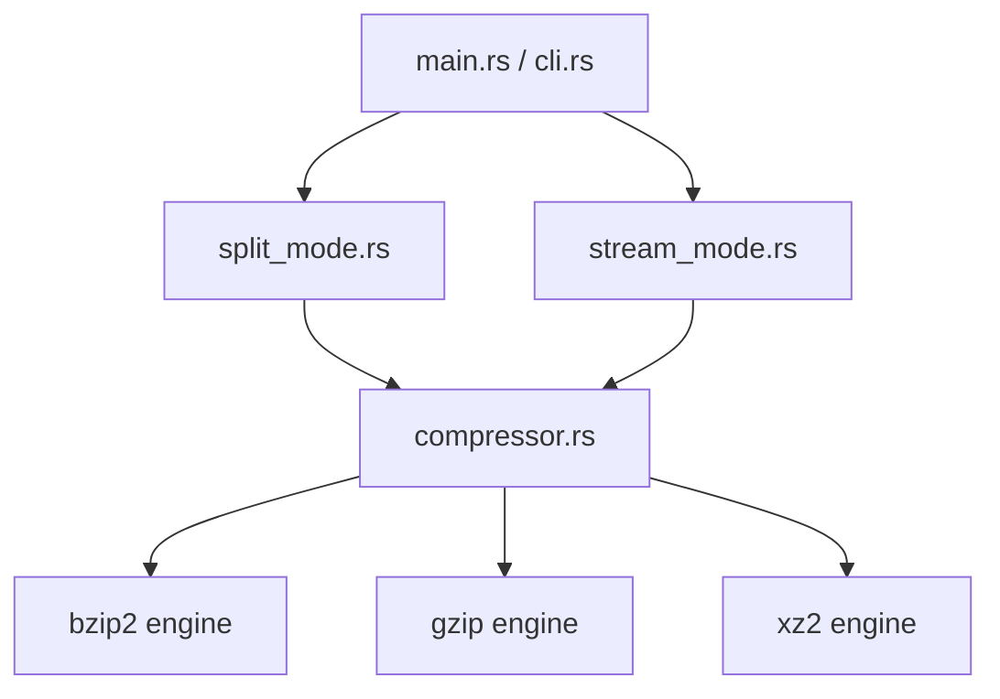

Rust Technical Architecture Specification for zipmt-rust.

TLDR:
    Goal: Define the system design, modular breakdown, and concurrency flow of zipmt-rust.
    Status: Technical design drafted with safe concurrency pipelines and backpressure.
    Action: Defer to Smith for Gate 2 review and approval.

# Technical Architecture: zipmt-rust

This document outlines the technical design, module structure, and concurrency pipelines for `zipmt-rust`.

---

## 1. Modular Architecture

The utility is structured as a single binary crate containing the following modules:



### Module Responsibilities:
- **`main.rs` / `cli.rs`:** Parses parameters via `clap`, manages signal traps (for Ctrl-C/SIGINT), selects execution modes, and enforces exit status codes.
- **`compressor.rs`:** Declares the `Compressor` trait and instantiates the backend compression engines using safe wrappers around system compressors (`xz2`, `bzip2`, `flate2`).
- **`split_mode.rs`:** Handles file-based data-parallel compression.
- **`stream_mode.rs`:** Coordinates channel-based in-memory pipeline streaming.

---

## 2. Concurrency Model

`zipmt-rust` enforces strict separation of concurrency strategies depending on the selected execution mode:

### A. Split Mode (Data-Parallel File Chunking)
For files already present on disk, we divide them statically into chunks and process them in parallel using **Rayon**'s work-stealing thread pool:

```
[Input File] ──> Static Split into N chunks ──> [Rayon Thread Pool] ──> [Compressed Chunks] ──> Sequential Assembly ──> [Output File]
```

- **Efficiency:** Rayon automatically balances the work across all available cores without manual thread management.
- **Assembly:** Compressed chunks are written to temporary files or memory buffers and assembled sequentially to guarantee file integrity.

### B. Stream Mode (Channel-Based Pipeling)
For piped standard input stream data, we spawn dedicated reader and writer threads and channel workers:

```
              ┌───> [Worker Thread 1] ───┐
[Stdin] ──> [Reader Thread] ──Job Channel──> [Worker Thread 2] ──Result Channel──> [Writer Thread (BTreeMap)] ──> [Stdout]
              └───> [Worker Thread 3] ───┘
```

1. **Reader Thread:** Reads chunks of size 4MB from `stdin`. Packages data into a `Block` struct containing a sequence number and raw bytes. Sends blocks to the `Job Channel`.
2. **Worker Thread Pool:** Consumes blocks from the `Job Channel`, compresses the block payload using the selected algorithm, and sends the compressed block to the `Result Channel`.
3. **Writer Thread:** Consumes from the `Result Channel`. To account for out-of-order compression finishes, it caches blocks in a `BTreeMap<u64, Block>` keying by sequence number. It writes block payloads sequentially to `stdout` only when the next expected sequence number matches the map's minimum key.

---

## 3. Backpressure & Memory Bounds

To prevent unbounded memory growth on infinite input streams, we enforce channel constraints:

- The `Job Channel` is a **bounded channel** with size `threads * 2`.
- When worker threads are busy, the `Job Channel` fills up, blocking the `Reader Thread` on `send()`. This naturally throttles input reads from `stdin` and caps peak memory consumption to:
  $$\text{Peak Memory} \approx \text{threads} \times 2 \times 4\text{MB}$$

---

## 4. Safety & Panic Safety

1. **Memory Safety:** The crate root is marked `#![deny(unsafe_code)]` to guarantee compile-time memory safety.
2. **Error Handling:** All interface boundaries use Rust's `Result<T, Error>` type. Error propagation is handled via the `?` operator.
3. **Panic Catching:** Worker threads run inside isolated threads. If a thread panics (e.g. library error), the main thread catches the termination, logs the event to `stderr`, and aborts execution, cleaning up partial output files.
4. **Signal Hooking:** A global handler traps SIGINT/Ctrl-C:
   - Sets a cancellation flag.
   - Cleans up temporary files.
   - Preserves the original source file.

---

## 5. Traits & Types

```rust
pub trait Compressor {
    /// Compress input bytes.
    fn compress(&self, input: &[u8]) -> Result<Vec<u8>, ZipError>;

    /// Decompress and verify input integrity.
    fn verify(&self, input: &[u8]) -> Result<(), ZipError>;
}

pub struct Block {
    pub seq_num: u64,
    pub data: Vec<u8>,
}

#[derive(Debug)]
pub enum ZipError {
    Io(std::io::Error),
    Compression(String),
    Verification(String),
}
```
