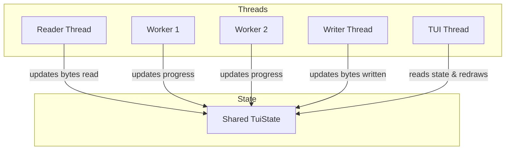

# TUI Progress Visualizer Architecture

This document describes the design, concurrency model, and rendering pipeline for the terminal UI progress visualizer in `zipmt-rust`.

## Objectives
- Real-time visualization of queue utilization, I/O rates, and compression efficiency.
- Dynamic stripe/split progress rendering in Split Mode.
- Lightweight ANSI-escaped console output written exclusively to `stderr` to avoid corrupting `stdout` redirections.
- Zero external dependency implementation (using raw terminal formatting and standard Rust threads).

## Concurrency and Shared State



### Shared State Structure
The visualizer state is represented by a central thread-safe `Arc<Mutex<TuiState>>`:

```rust
pub struct TuiState {
    pub total_input_size: usize,
    pub bytes_read: usize,
    pub bytes_written: usize,
    pub is_complete: bool,
    pub mode: TuiMode,
    pub stripes: Vec<StripeProgress>,
    pub queue_depth: usize,
    pub queue_capacity: usize,
}

pub struct StripeProgress {
    pub id: usize,
    pub bytes_processed: usize,
    pub total_bytes: usize,
    pub bytes_written: usize,
}
```

### Rendering Pipeline
1. **ANSI Control Codes**: Uses standard terminal cursor commands to perform in-place redraws instead of full screen clears, preventing flickering:
   - `\x1B[H`: Move cursor to home position.
   - `\x1B[J`: Clear screen from cursor down.
2. **Stderr Target**: All visual outputs are printed to `stderr` using `eprint!`. This guarantees that if the user pipes the output (e.g. `zipmt-rust file.txt -T > output.xz`), the compressed binary data is sent clean to `stdout` while visual stats show on the terminal.
3. **Throttling**: The TUI thread runs on a loop with a `std::thread::sleep(Duration::from_millis(100))` interval.

## UI Display Layouts

### Split Mode (File) Layout
```
[INFO] ZipMt Parallel Compression (Split Mode)
Stripe 0: [=====================>       ] 75% | In: 1.2MB, Out: 450KB (2.6x)
Stripe 1: [============================>] 100% | In: 1.2MB, Out: 410KB (2.9x)
Stripe 2: [======>                      ] 22% | In: 350KB, Out: 110KB (3.1x)
Stripe 3: [>                            ] 2%  | In: 30KB, Out: 9KB (3.3x)
--------------------------------------------------
Total: 65% | Throughput: 45.2 MB/s | Ratio: 2.8x
```

### Stream Mode Layout
```
[INFO] ZipMt Parallel Compression (Stream Mode)
Queue Depth: [====>            ] 4 / 16 blocks occupied
Throughput:
  - Read: 24.5 MB (8.2 MB/s)
  - Write: 8.4 MB (2.8 MB/s)
Compression Ratio: 2.9x (Instant: 3.1x)
Elapsed Time: 3.2s
```
