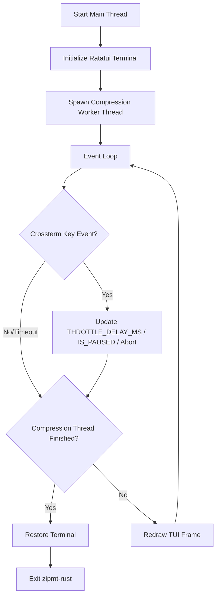

# User Stories, Acceptance Criteria & Architecture: Ratatui TUI Migration

This document combines the product stories (Cypher) and technical architecture (Morpheus) for migrating the `zipmt-rust` TUI to the widget-based `ratatui` library.

---

## 🎯 Sprint Goal
Migrate the custom ANSI-escaped terminal rendering to the widget-based Ratatui library, integrating keyboard event polling directly into the main-thread event loop, and updating snapshot tests using `TestBackend`.

---

## 📖 User Stories (Cypher)

### Story 1: Ratatui UI Rendering
- **As a** terminal user compressing files or streams
- **I want** the progress interface to render via Ratatui widgets while preserving the custom Star Trek LCARS diagnostics theme
- **So that** the UI looks polished, aligned, and is easier to maintain.

#### Acceptance Criteria
1. Replaces custom string building and manual terminal cursor positioning (`MoveTo`) in `draw_tui` with Ratatui widgets (`Paragraph`, `Block`, `Gauge`, or canvas/custom widgets).
2. Retains the retro LCARS coloring (Orange, Purple/Lavender, Cyan, Yellow) and unicode box-drawing borders.
3. Renders the layout blocks:
   - **System Diagnostics**: Cumulative metrics (bytes read/written, ratio, elapsed time).
   - **Sectors Progress**: Stripe list with progress bars side-by-side (Split Mode).
   - **Transporter Buffer**: Queue capacity gauge (Stream Mode).
   - **Ingest Speed History**: Rolling MB/s timeline rendered via a vertical bar chart.
   - **Control Panel**: Keyboard controls and current status.

### Story 2: Main-Thread Event Polling Loop
- **As a** terminal user throttling or pausing compression
- **I want** the TUI to poll for keystrokes in the main loop thread instead of spawning a separate background keyboard listener thread
- **So that** event management is robust, deterministic, and doesn't cause race conditions on terminal restore.

#### Acceptance Criteria
1. Replaces the background keyboard listener thread with Crossterm event polling (`event::poll` with a tick rate, e.g., 100ms or 250ms) in the main thread.
2. The event loop correctly captures and handles:
   - `+` / `=` (Speed Up: decrease `THROTTLE_DELAY_MS` atomic by 50ms, min 0ms).
   - `-` (Slow Down: increase `THROTTLE_DELAY_MS` atomic by 50ms, max 500ms).
   - `p` / `P` (Pause/Resume: toggle `IS_PAUSED` atomic and update dashboard state).
   - `q` / `Esc` (Abort: restore terminal state, delete partial output, exit with code 2).

### Story 3: Defaulting TUI and Auto-Redirection
- **As a** systems administrator piping compression outputs
- **I want** the TUI to run by default for all compression runs, but automatically disable itself if output is piped or standard streams are not interactive TTYs
- **So that** I don't need to specify `-T` manually, and piped data is never corrupted by ANSI drawing codes.

#### Acceptance Criteria
1. Removes the option/flag `-T` / `--tui` from CLI options. TUI mode runs by default on normal compression.
2. Automatically disables TUI mode and falls back to standard/raw stream output if:
   - Writing output to standard output (`-c` or stdout redirection).
   - Either standard input or standard output is detected as non-TTY.

### Story 4: Test Suite Snapshot compatibility
- **As a** developer verifying code correctness
- **I want** the layout snapshot tests to continue validating the drawn UI output
- **So that** I am warned immediately if a change breaks the TUI alignment or text contents.

#### Acceptance Criteria
1. Replaces the vec buffer injection in snapshot tests with Ratatui's `TestBackend`.
2. Existing layout snapshot files (`zipmt_rust__tui__tests__tui_layout_split_mode_snapshot.snap` and `zipmt_rust__tui__tests__tui_layout_stream_mode_snapshot.snap`) are updated and pass successfully under `make test-rust`.

---

## 🏛️ Technical Architecture (Morpheus)

### 1. Decoupled Terminal Draw Loop
Instead of printing raw ANSI strings directly to stderr, the drawing logic will render using Ratatui's `Terminal` object parameterized over the `Backend` trait:
- In production: `CrosstermBackend<std::io::Stderr>`
- In tests: `TestBackend`

```rust
pub fn draw_tui<B: ratatui::backend::Backend>(
    terminal: &mut ratatui::Terminal<B>,
    state: &TuiState,
) -> Result<(), std::io::Error> {
    terminal.draw(|f| {
        // Layout breakdown & widget rendering using Ratatui
    })?;
    Ok(())
}
```

### 2. Main-Thread Coordination Loop
We replace the separate keyboard listener thread. The main thread will run the application control loop:



- **Abort path**: If `q` or `Esc` is pressed, the event loop breaks, triggers terminal cleanup, deletes the output file path registered in `OUTPUT_FILE_PATH`, and exits.
- **Worker safety**: Compression runs in a separate thread, safely communicating progress update points to `TuiState` (via `Arc<Mutex<TuiState>>`).
