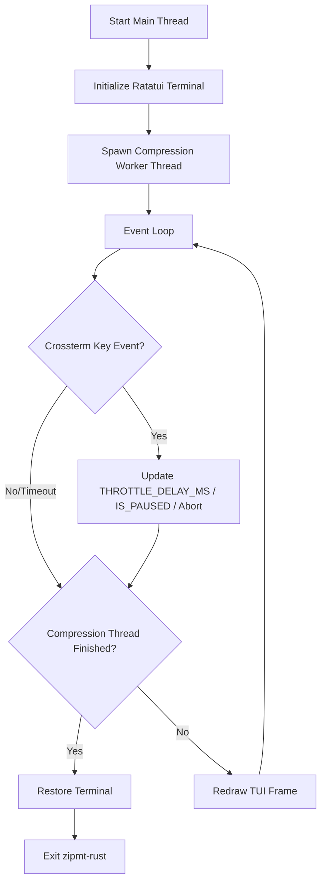

# User Stories, Acceptance Criteria & Architecture: Ratatui TUI Migration

This document combines the product stories (Cypher) and technical architecture (Morpheus) for migrating the `zipmt-rust` TUI to the widget-based `ratatui` library.

---

## 🎯 Sprint Goal
Migrate the custom ANSI-escaped terminal rendering to the widget-based Ratatui library, integrating keyboard event polling directly into the main-thread event loop, and updating snapshot tests using `TestBackend`.

---

## 📖 User Stories (Cypher)

### Story 1: Ratatui UI Rendering
- **As a** terminal user compressing files or streams
- **I want** the progress interface to render via Ratatui widgets while preserving the custom Star Trek LCARS diagnostics theme
- **So that** the UI looks polished, aligned, and is easier to maintain.

#### Acceptance Criteria
1. Replaces custom string building and manual terminal cursor positioning (`MoveTo`) in `draw_tui` with Ratatui widgets (`Paragraph`, `Block`, `Gauge`, or canvas/custom widgets).
2. Retains the retro LCARS coloring (Orange, Purple/Lavender, Cyan, Yellow) and unicode box-drawing borders.
3. Renders the layout blocks:
   - **System Diagnostics**: Cumulative metrics (bytes read/written, ratio, elapsed time).
   - **Sectors Progress**: Stripe list with progress bars side-by-side (Split Mode).
   - **Transporter Buffer**: Queue capacity gauge (Stream Mode).
   - **Ingest Speed History**: Rolling MB/s timeline rendered via a vertical bar chart.
   - **Control Panel**: Keyboard controls and current status.

### Story 2: Main-Thread Event Polling Loop
- **As a** terminal user throttling or pausing compression
- **I want** the TUI to poll for keystrokes in the main loop thread instead of spawning a separate background keyboard listener thread
- **So that** event management is robust, deterministic, and doesn't cause race conditions on terminal restore.

#### Acceptance Criteria
1. Replaces the background keyboard listener thread with Crossterm event polling (`event::poll` with a tick rate, e.g., 100ms or 250ms) in the main thread.
2. The event loop correctly captures and handles:
   - `+` / `=` (Speed Up: decrease `THROTTLE_DELAY_MS` atomic by 50ms, min 0ms).
   - `-` (Slow Down: increase `THROTTLE_DELAY_MS` atomic by 50ms, max 500ms).
   - `p` / `P` (Pause/Resume: toggle `IS_PAUSED` atomic and update dashboard state).
   - `q` / `Esc` (Abort: restore terminal state, delete partial output, exit with code 2).

### Story 3: Defaulting TUI and Auto-Redirection
- **As a** systems administrator piping compression outputs
- **I want** the TUI to run by default for all normal compression runs, but automatically disable itself if stdout is redirected (e.g., `-c` flag or shell redirection) or if either stdin or stdout is not a TTY (interactive terminal)
- **So that** I don't need to specify `-T` manually, and piped data is never corrupted by TUI drawing or terminal cursor movement ANSI codes.

#### Acceptance Criteria
1. **Remove `-T` / `--tui` Flag**: The `-T` / `--tui` flag must be completely removed from the CLI options parsing struct (`Args` in Clap).
2. **Default TUI Execution**: Normal file and stream compression operations run in TUI mode by default.
3. **Auto-Redirection / Fallback Logic**: Automatically disable TUI mode and run in non-TUI (standard/raw stream) mode if any of the following are true:
   - Output is being written to stdout (explicitly via `-c` / `--stdout` flag, or implicitly because no output file is specified and standard output is redirected/piped).
   - Standard output is redirected to a file, pipe, or other non-TTY target.
   - Standard input is redirected (non-TTY) when reading from stdin.
4. **TTY Check Mechanism**: TTY status must be verified using the standard library `std::io::IsTerminal` trait on `std::io::stdin()` and `std::io::stdout()`.
5. **No Stream Corruption**: When TUI is disabled, no TUI initialization or Crossterm terminal state modifications (such as enabling raw mode or entering alternate screen) may occur. Output must flow cleanly without any terminal-drawn decoration, and progress logs can optionally print to `stderr` in plain-text verbose format if requested.

### Story 4: Test Suite Snapshot compatibility
- **As a** developer verifying code correctness
- **I want** the layout snapshot tests to continue validating the drawn UI output
- **So that** I am warned immediately if a change breaks the TUI alignment or text contents.

#### Acceptance Criteria
1. Replaces the vec buffer injection in snapshot tests with Ratatui's `TestBackend`.
2. Existing layout snapshot files (`zipmt_rust__tui__tests__tui_layout_split_mode_snapshot.snap` and `zipmt_rust__tui__tests__tui_layout_stream_mode_snapshot.snap`) are updated and pass successfully under `make test-rust`.

---

## 🏛️ Technical Architecture (Morpheus)

### 1. Decoupled Terminal Draw Loop
Instead of printing raw ANSI strings directly to stderr, the drawing logic will render using Ratatui's `Terminal` object parameterized over the `Backend` trait:
- In production: `CrosstermBackend<std::io::Stderr>`
- In tests: `TestBackend`

```rust
pub fn draw_tui<B: ratatui::backend::Backend>(
    terminal: &mut ratatui::Terminal<B>,
    state: &TuiState,
) -> Result<(), std::io::Error> {
    terminal.draw(|f| {
        // Layout breakdown & widget rendering using Ratatui
    })?;
    Ok(())
}
```

### 2. Main-Thread Coordination Loop
We replace the separate keyboard listener thread. The main thread will run the application control loop:



- **Abort path**: If `q` or `Esc` is pressed, the event loop breaks, triggers terminal cleanup, deletes the output file path registered in `OUTPUT_FILE_PATH`, and exits.
- **Worker safety**: Compression runs in a separate thread, safely communicating progress update points to `TuiState` (via `Arc<Mutex<TuiState>>`).

### 3. Default TUI & Fallback TTY Detection

To support seamless CLI operation, the `-T` / `--tui` CLI flag is completely removed from the clap `Args` structure. Instead, TUI mode is enabled by default for all normal compression operations and is conditionally disabled based on standard stream redirection or explicit user piping instructions.

#### Detection and Fallback Logic Flow:
1. **Remove Flag**: Ensure the clap arguments parser struct does not define the `tui` field or the `-T` / `--tui` options.
2. **Retrieve Stream Information**:
   - Check if standard output is a TTY: `std::io::stdout().is_terminal()` (from the `std::io::IsTerminal` trait, available in standard library since Rust 1.70).
   - Check if standard input is a TTY: `std::io::stdin().is_terminal()`.
3. **Analyze CLI Redirection Indicators**:
   - Check if stdout output redirection is active (e.g., `args.stdout` is true, indicating the `-c` / `--stdout` flag).
   - Check if the utility is reading from stdin (`is_stdin` is true).
4. **Evaluate TUI Activation Rule**:
   - The TUI must run *only* if:
     - Output is NOT directed to standard output (`!args.stdout`).
     - Standard output is a valid interactive terminal (`std::io::stdout().is_terminal()`).
     - If reading from standard input (`is_stdin`), then standard input must also be an interactive terminal (`std::io::stdin().is_terminal()`).
   - If any of these checks fail (e.g., output is redirected, stdin is not a TTY when reading from it, or stdout is not a TTY), TUI mode is disabled and the application falls back to standard stream/raw output mode.

#### Code Architecture in `main.rs`:

```rust
use std::io::IsTerminal;

fn run_app(args: Args, compressor: Arc<Box<dyn Compressor + Send + Sync>>) -> Result<(), ZipError> {
    // ...
    let is_stdin = args.input_file.is_none() || args.input_file.as_deref() == Some("-");
    
    // Defaulting TUI and Fallback checks
    let stdout_is_tty = std::io::stdout().is_terminal();
    let stdin_is_tty = std::io::stdin().is_terminal();
    
    let is_stdout_redirected = args.stdout || args.output.is_none() && is_stdin;
    
    let run_tui = if is_stdout_redirected {
        false
    } else if !stdout_is_tty {
        false
    } else if is_stdin && !stdin_is_tty {
        false
    } else {
        true
    };

    // Support override for forced testing / debugging if environment variable is set
    let force_tui = std::env::var("ZIPMT_FORCE_TUI").is_ok();
    let run_tui = run_tui || force_tui;
    
    // ...
}
```

#### Safe Non-TUI Execution:
If `run_tui` resolves to `false`:
- The application bypasses terminal setup (raw mode is not initialized, and the alternate screen is not entered).
- Bypasses drawing and Crossterm event loop polling.
- Runs compression cleanly on standard stream readers/writers.
- In verbose mode, plain-text diagnostic log messages are printed to `stderr` using `eprintln!`, ensuring no ANSI pollution on `stdout`.

